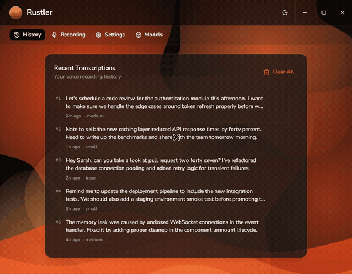

<p align="center">
  
</p>

<h1 align="center">Rustler</h1>

<p align="center">
  <strong>Local speech-to-text that respects your privacy. Powered by Whisper, forged in Rust.</strong>
</p>

<p align="center">
  <a href="#features">Features</a> &bull;
  <a href="#installation">Installation</a> &bull;
  <a href="#building-from-source">Building from Source</a> &bull;
  <a href="#usage">Usage</a> &bull;
  <a href="#tech-stack">Tech Stack</a> &bull;
  <a href="#license">License</a>
</p>

<p align="center">
  <a href="https://github.com/Celli119/rustler/actions/workflows/ci.yml"></a>
  <a href="https://codecov.io/gh/Celli119/rustler"></a>
  
  
  
  
  
</p>

---

<!-- Record a new demo: ./scripts/record-demo.sh -->
<p align="center">
  
</p>

## What is Rustler?

Rustler is a desktop speech-to-text application that runs entirely on your machine. No cloud services, no API keys, no data leaving your device. Press a hotkey, speak, and your words appear as text -- transcribed locally using [whisper.cpp](https://github.com/ggerganov/whisper.cpp) through a native Rust backend.

Your voice, your hardware, your data. Nothing crosses the wire.

## Features

**Local & Private**

- All transcription happens on-device using Whisper models. Zero network calls during recognition.
- Models are downloaded once from HuggingFace and stored locally.

**Global Hotkey**

- Bind a system-wide keyboard shortcut to start and stop recording from any application.
- Full Wayland support via xdg-desktop-portal (GNOME, KDE Plasma, Hyprland, Sway).
- X11 support via the Tauri global shortcut plugin.

**GPU Acceleration**

- Optional CUDA support for significantly faster transcription on NVIDIA GPUs.
- Toggle GPU acceleration on or off from the settings panel.

**Multiple Whisper Models**

- Choose from six models: Tiny, Base, Small, Medium, Large (v3), and Turbo (v3-turbo).
- Download and manage models directly from the app. Smaller models are fast; larger models are accurate.
- Smart model caching automatically unloads unused models after 5 minutes of inactivity to conserve memory.

**Auto-Paste**

- Transcribed text is automatically pasted into the application you were using when you started recording. Speak and it types.

**System Tray Integration**

- Minimizes to the system tray on close so your hotkey keeps working in the background.
- Tray icon with quick access menu (Show Window / Quit).
- System notifications for recording status.

**Transcription History**

- Browse, copy, and manage all past transcriptions.
- One-click copy to clipboard. Clear individual entries or the entire history.

**Multi-Language Support**

- Supports 10 languages out of the box: English, Spanish, French, German, Italian, Portuguese, Russian, Chinese, Japanese, and Korean.
- Auto-detect mode lets Whisper identify the language for you.

**Polished UI**

- Dark and light themes with system preference detection.
- Dune-inspired design with flowing copper gradients.
- Custom splash screen to eliminate white flash on startup.
- Custom window chrome with draggable title bar.

## Installation

### Linux

Pre-built `.deb` and `.rpm` packages are available on the [Releases](https://github.com/Celli119/rustler/releases) page.

**Runtime dependencies:**

For clipboard and auto-paste functionality, install these system packages:

```bash
# Wayland
sudo apt install wl-clipboard wtype

# X11
sudo apt install xclip xdotool
```

### macOS & Windows

Cross-platform support is in progress. The Rust backend already includes platform-specific clipboard implementations for macOS (via Cocoa/objc) and Windows (via the windows crate). Builds for these platforms are coming soon.

## Building from Source

### Prerequisites

- [Rust](https://rustup.rs/) (1.77.2 or later)
- [Bun](https://bun.sh/) (JavaScript runtime and package manager)
- [Tauri CLI v2](https://v2.tauri.app/start/prerequisites/)
- System development libraries for your platform:

```bash
# Ubuntu / Debian
sudo apt install libwebkit2gtk-4.1-dev libgtk-3-dev libayatana-appindicator3-dev \
  librsvg2-dev libasound2-dev patchelf libclang-dev

# Fedora
sudo dnf install webkit2gtk4.1-devel gtk3-devel libappindicator-gtk3-devel \
  librsvg2-devel alsa-lib-devel
```

For CUDA GPU acceleration, you also need the [CUDA Toolkit](https://developer.nvidia.com/cuda-toolkit) installed.

### Build

```bash
# Clone the repository
git clone https://github.com/Celli119/rustler.git
cd rustler

# Install frontend dependencies
bun install

# Build the app (CPU-only)
bunx tauri build

# Build with CUDA GPU support
bunx tauri build -- --features cuda
```

The built application will be in `src-tauri/target/release/bundle/`.

### Development

```bash
# Run in development mode (Wayland -- recommended)
bun run tauri:dev

# Run in development mode (X11 fallback)
bun run tauri:dev:x11

# Run tests
bun test                              # Frontend tests
cd src-tauri && cargo test             # Backend tests

# Lint and format
bun run lint
bun run format
cd src-tauri && cargo clippy --all-targets --features cuda -- -D warnings
```

> **Note on Wayland development:** The `tauri:dev` script uses `systemd-run` to launch the app with a proper reverse-DNS application ID (`com.rustler.desktop`), which is required for the xdg-desktop-portal global shortcuts to work on GNOME 49+.

## Usage

1. **Download a model** -- Open the Models tab and download at least one Whisper model. The "base" model is a good starting point (141 MB, fast, decent accuracy). For higher accuracy, try "small" or "medium".

2. **Set your hotkey** -- Go to the Recording tab to configure a global keyboard shortcut. On Wayland, clicking "Change Hotkey" opens the system shortcut dialog. On X11, click "Record Hotkey" and press your desired key combination.

3. **Start transcribing** -- Press your hotkey anywhere on your desktop. Speak naturally. Press the hotkey again to stop. The transcribed text is automatically pasted into whatever application had focus.

4. **Review history** -- The History tab keeps a log of all your transcriptions with timestamps and the model used. Copy any entry to the clipboard or clear your history when you are done.

5. **Tune settings** -- In the Settings tab, choose your transcription language and toggle GPU acceleration if you have an NVIDIA GPU with CUDA.

The app lives in your system tray. Close the window and it keeps running in the background, ready for your next hotkey press.

## Tech Stack

| Layer              | Technology                                                                                                     |
| ------------------ | -------------------------------------------------------------------------------------------------------------- |
| Framework          | [Tauri v2](https://v2.tauri.app/)                                                                              |
| Backend            | [Rust](https://www.rust-lang.org/) (2021 edition)                                                              |
| Speech Recognition | [whisper-rs](https://github.com/tazz4843/whisper-rs) / [whisper.cpp](https://github.com/ggerganov/whisper.cpp) |
| Audio Capture      | [cpal](https://github.com/RustAudio/cpal) (cross-platform)                                                     |
| Frontend           | [React 19](https://react.dev/) + [TypeScript](https://www.typescriptlang.org/)                                 |
| Styling            | [Tailwind CSS v4](https://tailwindcss.com/)                                                                    |
| UI Components      | [shadcn/ui](https://ui.shadcn.com/) + [Base UI](https://base-ui.com/)                                          |
| State Management   | [Zustand](https://github.com/pmndrs/zustand)                                                                   |
| Build Tooling      | [Vite 7](https://vite.dev/) + [Bun](https://bun.sh/)                                                           |
| Linting            | [oxlint](https://oxc.rs/) + [Clippy](https://github.com/rust-lang/rust-clippy)                                 |
| Formatting         | [oxfmt](https://oxc.rs/) + [rustfmt](https://github.com/rust-lang/rustfmt)                                     |
| Testing            | [Vitest](https://vitest.dev/) (frontend) + `cargo test` (backend)                                              |
| Wayland Shortcuts  | [ashpd](https://github.com/bilelmoussaoui/ashpd) (xdg-desktop-portal)                                          |

## Project Structure

```
rustler/
  src/                      # React frontend
    components/             # UI components (tabs, layout, controls)
    hooks/                  # React hooks (recording, hotkey, settings, models)
    stores/                 # Zustand state stores
    lib/                    # Tauri command bindings and utilities
  src-tauri/                # Rust backend
    src/
      audio/                # Audio recording via cpal
      clipboard/            # Platform-specific paste (Linux, macOS, Windows)
      commands/             # Tauri command handlers
      hotkey/               # Global shortcut management (Wayland + X11)
      models/               # Whisper model downloading
      whisper/              # Transcription engine and model caching
    icons/                  # App icons (dune-themed)
  index.html                # Entry point with splash screen
```

## Contributing

Contributions are welcome! Please feel free to submit a Pull Request.

## License

[MIT](LICENSE)

## Acknowledgments

- [OpenAI Whisper](https://github.com/openai/whisper) for the speech recognition model
- [whisper.cpp](https://github.com/ggerganov/whisper.cpp) for the C++ implementation
- [Tauri](https://tauri.app) for the cross-platform framework

---

<p align="center">
  <sub>Built with patience, tested in the silence between keystrokes.</sub>
</p>
